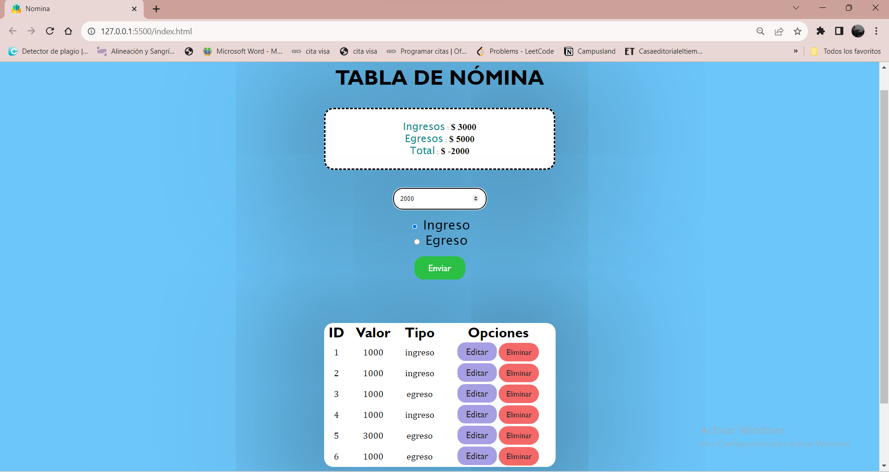
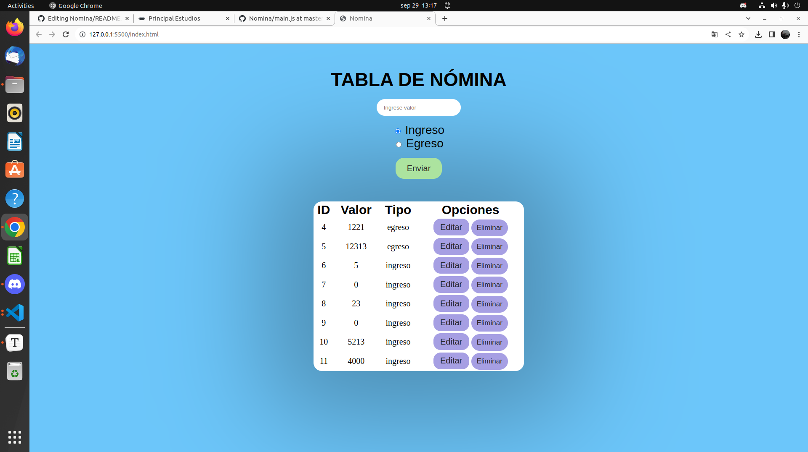
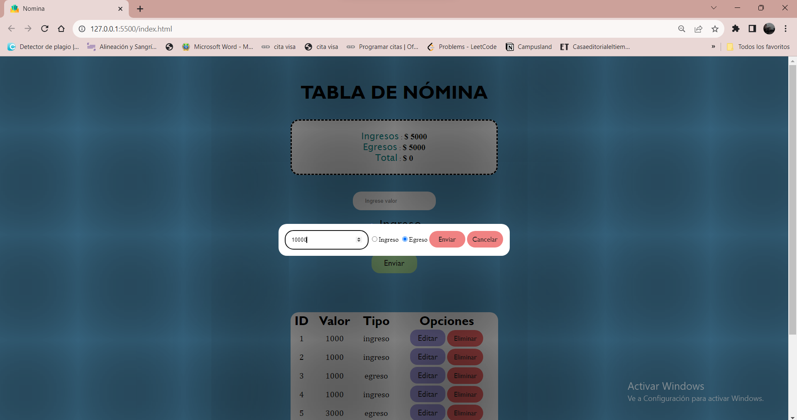
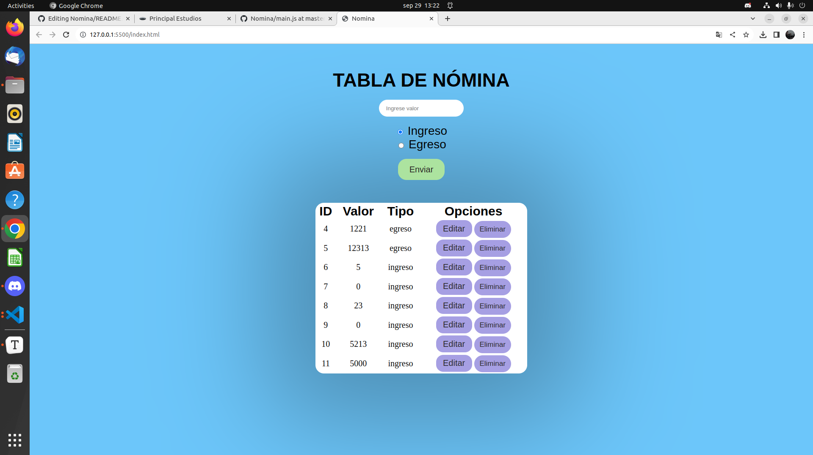
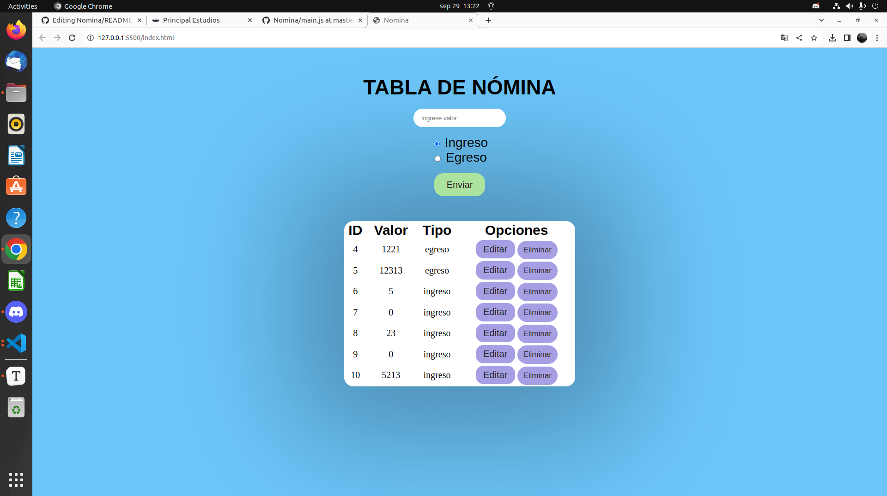

# Proyecto Nómina con JSON server

Este proyecto se hace con el fin de no depender de una API externa, sino que hacer la nuestra con ayuda de JSON server y poder utilizarla con más facilidad al momento de recibir datos y mostrarlos.

#### Tecnologías utilizadas

- HTML
- CSS
- JavaScript
- JSON server
- JSON 

#### ¿Cómo usar la página?

1. Puedes ingresar el valor que deseas y seleccionar si es Ingreso o Egreso, luego dale Enviar:

    

    ##### Nota: No se pueden ver los datos hasta que digite un valor.

2. Una vez dado el valor y la asignación del tipo de valor, se te agrega automáticamente a la tabla de nómina:

   

3. Ahora podrás utilizar las dos funciones (Editar o Eliminar).

4. Para editar, le das al botón del mismo nombre y te va aparecer esta ventana:

   

5. Ahora podrás editar tu valor y tu tipo de valor y le das enviar.

    

6. Ahora para eliminar le das en su respectivo botón y se actualiza automáticamente:

    

      
##### Autora

Angie Cardenas