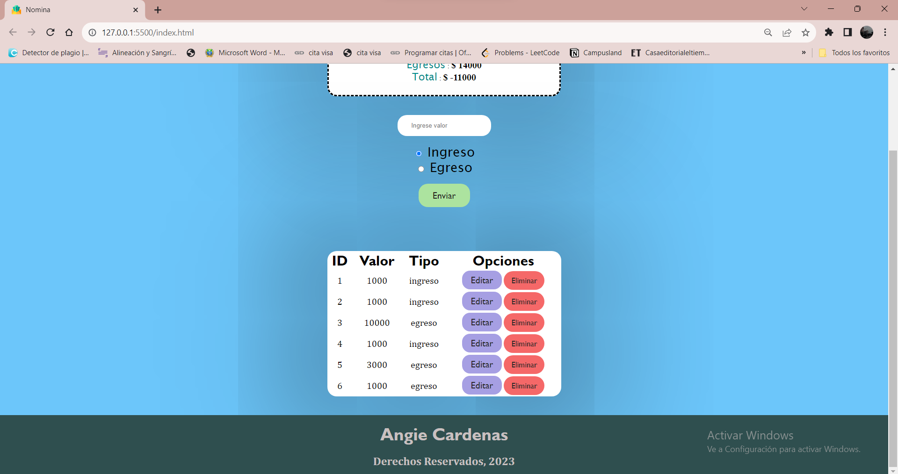

# Proyecto Nómina con JSON server

Este proyecto se hace con el fin de no depender de una API externa, sino que hacer la nuestra con ayuda de JSON server y poder utilizarla con más facilidad al momento de recibir datos y mostrarlos.

#### Funciones de una base de datos (CRUD)

<h5>C => Create:</h5> Acá se verifica que los datos que se requieran en nuestra página sean creados en nuestra base de datos(MockApi)

<h5>R => Read:</h5> En nuestra página se deben ver los valores que le añadimos, por eso esta parte del Read.

<h5>U => Update:</h5> Se debe garantizar que si el usuario edita su linea de trabajo,  poder actualizarse la información de manera automática y vista posteriormente.

<h5>D => Delete:</h5> El usuario puede tener acceso al boton delete, para eliminar la linea de código no deseada.

#### Tecnologías utilizadas

- HTML
- CSS
- JavaScript
- JSON server
- JSON 

#### ¿Cómo usar la página?

1. Puedes ingresar el valor que deseas y seleccionar si es Ingreso o Egreso, luego dale Enviar:

    

    ##### Nota: No se pueden ver los datos hasta que digite un valor.

2. Una vez dado el valor y la asignación del tipo de valor, se te agrega automáticamente a la tabla de nómina:

   

3. Ahora podrás utilizar las dos funciones (Editar o Eliminar).

4. Para editar, le das al botón del mismo nombre y te va aparecer esta ventana:

   

5. Ahora podrás editar tu valor y tu tipo de valor y le das enviar.

    

6. Ahora para eliminar le das en su respectivo botón y se actualiza automáticamente:

    

7. Recuerda que puedes visualizar el total a pagar dependiendo de tus ingresos y egresos.

#### Adicionales

- ##### Package.json:

  Para iniciar el servidor primero se debe instalar el package.json para tener le port y el host , por lo cual es el dev en los scripts.

- ##### Node: 

  Se utilizaron los módulos de node para desarrollar esta actividad.

- ##### Dependencias: 

  Se necesitan instalar las dependencias para que el servidor pueda ejecutarse y por lo cual la página funcione, de esta forma se instalan: `npm -E -D install json-server`y de esta forma se corre el servidor: `npm run dev`

#### Autora

Angie Nathalia Cardenas Pinzón